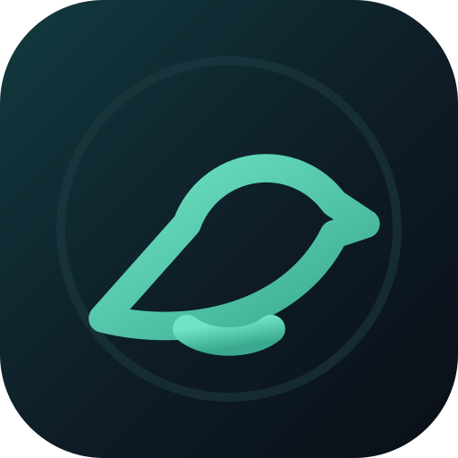
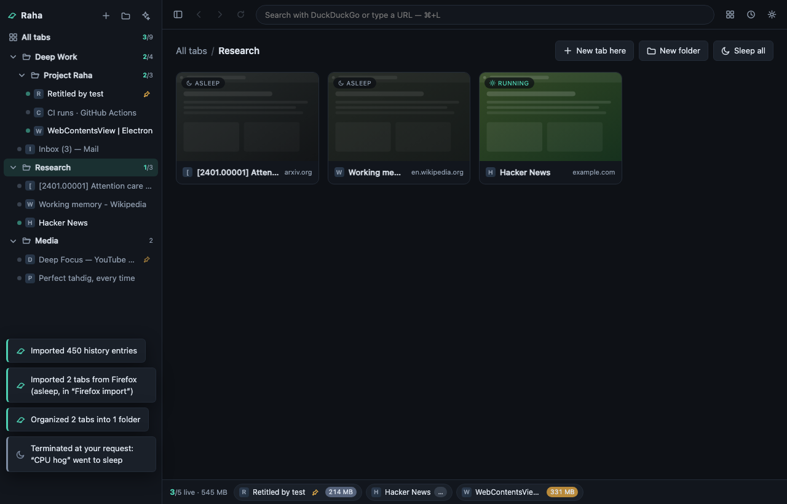

<div align="center">
  

# Raha

**A calm, private, open-source browser where *you* decide which tabs get to spend your RAM and CPU.**

*Raha (رها) is Persian for "free, released, let go".*

[](../../actions/workflows/ci.yml)
[](LICENSE)
[-4fd1b3)](docs/DECISIONS/ADR-0009-ghostery-adblocker-bundled-lists.md)


</div>

## The idea

Every browser lets you open a hundred tabs. None of them lets you decide what
that costs. Raha inverts the deal:

- **You set a cap** — say, 6 live tabs. Everything else is **asleep**: zero
  RAM, zero CPU, but right where you left it (thumbnail, title, history,
  position in your folders). Click and it's back.
- **The live bar always shows the truth** — every running tab with its actual
  memory and CPU, sampled from the OS. No mystery meat.
- **You program the exceptions** — pin a tab to keep it alive forever, give
  `*.slack.com` an 800 MB allowance, keep `*.music.youtube.com` running by
  rule. First match wins. Tabs playing audio are protected by default.
- **Organization is spatial** — nested folders, thumbnail grids, drag & drop.
  A restart brings your whole tree back **asleep**: instant start, ~0 tab memory,
  nothing lost.

## The governor

The heart of Raha is ~150 lines of pure, exhaustively-tested policy
([`src/shared/policy.js`](src/shared/policy.js)). In precedence order:

1. **Per-tab memory limit** — a tab over its own limit goes to sleep, even a
   pinned one (you asked for *that* limit). The active tab is never yanked —
   you get a warning instead.
2. **Idle timer** *(off by default)* — background tabs idle longer than N
   minutes go to sleep.
3. **Live-tab cap** — beyond the cap, the least-recently-used background tab
   sleeps first. Pinned, audible, and active tabs are protected.
4. **Global memory budget** *(off by default)* — if running tabs together
   exceed your budget, LRU eviction until they fit.

Sleeping is real: the renderer **process is destroyed** and the RAM goes back
to your OS ([why](docs/DECISIONS/ADR-0006-sleep-is-process-destruction.md)) —
not merely throttled or hidden. Navigation history survives; back/forward
work after waking.

## Private by architecture

| | |
|---|---|
| Telemetry, phone-home | **No telemetry, ever.** Raha itself contacts exactly one server: GitHub Releases, for the optional security-update check — on by default, one toggle to silence it ([invariant #6](docs/INVARIANTS.md), [ADR-0008](docs/DECISIONS/ADR-0008-auto-updates.md)). Note the chrome also loads **favicons** directly from the sites in your tab list, including on a cold start with every tab asleep |
| Tracker/ad blocking | EasyList + EasyPrivacy via Ghostery's open-source engine ([ADR-0009](docs/DECISIONS/ADR-0009-ghostery-adblocker-bundled-lists.md), MPL-2.0) — lists **bundled** with the app (never fetched at runtime), separate ads/trackers toggles, per-site off switch on the address-bar shield |
| Global Privacy Control | `Sec-GPC: 1` + `DNT: 1` on every request made by a page (toggleable). Favicon loads from the chrome itself do not carry them |
| Permission requests (camera, microphone, location, notifications, clipboard) | Asked per site, in Raha's own prompt — allow once / always / never — never granted silently, never a surprise system dialog; remembered answers are one click away in Settings ([ADR-0013](docs/DECISIONS/ADR-0013-site-permissions.md)). Everything else a page asks for is refused, visibly |
| Default search | DuckDuckGo (Brave/Startpage/Ecosia/Google/Bing/Kagi selectable) |
| New tab page | Local. Loads nothing. |
| HTTPS | HTTPS-first for typed addresses, explicit opt-in for plain-HTTP fallback |
| Web content isolation | Chromium sandbox on, no preload/bridge in page processes ([invariant #5](docs/INVARIANTS.md)) |
| What a page may open | Only `http:`/`https:`/`raha:`/`blob:` — a site cannot make Raha open `file:///…` or a fake `data:` login page in your chrome ([invariant #13](docs/INVARIANTS.md)) |
| Supply chain | **Two direct runtime dependencies**: the updater ([ADR-0008](docs/DECISIONS/ADR-0008-auto-updates.md)) and the filter-list engine ([ADR-0009](docs/DECISIONS/ADR-0009-ghostery-adblocker-bundled-lists.md)), both pinned exact. With transitives, 28 npm packages ship inside the app alongside Electron — verify with `npm ls --omit=dev --all`. Everything else is this repo's own code |

Honesty note: Raha is Chromium under the hood (via Electron ~100 MB
installed). The "light" we promise is **runtime discipline** — 60 tabs open,
only your chosen few consuming anything — not installer size. Fingerprinting
resistance is [on the roadmap](docs/ROADMAP.md) and won't be claimed before
it's real.

## Install

Grab the installer for your OS from
**[Releases](../../releases)**: Linux AppImage/deb · Windows installer ·
macOS 13 or later, dmg (unsigned in v0.1: right-click → Open the first time).
Or start at the website: <https://magronox.github.io/raha-browser/>.

**New here? Read the [User Guide](docs/USER_GUIDE.md)** — install, first
five minutes, every setting, rules recipes, shortcuts, troubleshooting.
First launch opens a built-in one-minute tour (`raha://welcome`, revisitable
anytime).

Or run from source (Node ≥ 22):

```bash
git clone https://github.com/Magronox/raha-browser
cd raha-browser
npm install
npm start
```

There is deliberately **no build step** — what's in `src/` is what runs
([ADR-0003](docs/DECISIONS/ADR-0003-no-build-step.md)).

## Keyboard

`Ctrl/Cmd+T` new tab · `Ctrl/Cmd+W` close (on the grid: back to your last tab) ·
`Ctrl/Cmd+Shift+T` reopen closed tab · `Ctrl/Cmd+L` address bar · `Ctrl/Cmd+F` find in page ·
`Ctrl/Cmd+Shift+R` hard reload · `Ctrl/Cmd+E` grid/home · `Ctrl/Cmd+Shift+B` toggle sidebar ·
`Cmd+Y` (`Ctrl+H`) history · `Ctrl+Tab` cycle running tabs · `Ctrl/Cmd+1…9` jump to running tab ·
`Ctrl/Cmd+Shift+S` sleep this tab · `Ctrl/Cmd+Shift+A` sleep everything ·
`Ctrl/Cmd+Shift+K` pin (keep alive) · `Ctrl/Cmd+,` settings · `F12` devtools

## Status

**v0.1.0 — young but honest.** The engine (tab lifecycle, governor,
folders, persistence, privacy layer) is thoroughly tested — hundreds of unit
tests, a UI harness in real Chromium, an e2e suite on real Electron, and a
smoke self-test — and has been through a
[pre-launch security audit](docs/SECURITY-AUDIT-2026-07.md) against
Electron's official checklist. Expect rough edges; file issues generously. The
[roadmap](docs/ROADMAP.md) is public and numbered.

## Contributing (humans and AI agents)

This codebase is deliberately structured for safe iteration by both:
a pure, fully-tested core; a thin quarantined Electron layer; one-file IPC
contract; invariants that are enforced by tests, not vibes.

- Humans: start with [CONTRIBUTING.md](CONTRIBUTING.md).
- AI agents: your entry point is **[CLAUDE.md](CLAUDE.md)** (works for any
  agent). Step-by-step playbooks for common changes live in
  [docs/PLAYBOOKS/](docs/PLAYBOOKS/).
- Everything meaningful is decided in [ADRs](docs/DECISIONS/) and guarded by
  [INVARIANTS.md](docs/INVARIANTS.md).

```bash
npm run verify   # typecheck + lint + unit + UI harness + e2e — the definition of done
```

## Support

Raha is free, GPL, and has no business model — there is nothing to pay
for, no subscription, no product. If it's been useful and you feel like
leaving something:
[support Raha via Venmo](https://venmo.com/u/magronox).

## License & name

Code: [GPL-3.0-only](LICENSE) © 2026 Amir Basareh — forks stay open source.
The **Raha** name and bird mark are reserved: see [TRADEMARK.md](TRADEMARK.md).
Why this combination: [ADR-0002](docs/DECISIONS/ADR-0002-gpl3-plus-trademark.md).
